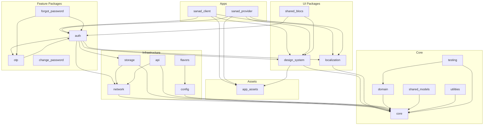

# Dependency Graph

## Overview



**Note:** `core` and `app_assets` are independent foundation-layer packages — there is **no edge between them in either direction**. `app_assets` contains zero UI/business knowledge (images, SVGs, icons, lottie/animations, and path constants only); `core` contains zero asset knowledge.

## Dependency Direction Rules

```
core, app_assets (parallel foundation layers, no edge between them)
      ↓
design_system
      ↓
feature packages (auth, otp, forgot_password, change_password)
      ↓
applications (sanad_client, sanad_provider)
```

Allowed:
- `sanad_provider` → `auth` → `network` → `core`
- `auth` → `design_system` → `core`
- `sanad_provider` → `app_assets` (apps may also depend on `app_assets` directly for app-shell usage, e.g. `main_shell.dart`)

Forbidden:
- `core` → `auth` (reverse)
- `auth` → `sanad_provider` (package importing app)
- `domain` → `data` (layer violation)
- `core` ↔ `app_assets` (either direction — both are independent foundation packages)
- **`design_system` → any feature package** (`auth`, `otp`, `forgot_password`, `change_password`) — verified zero violations by direct source inspection of `packages/design_system/pubspec.yaml` and `lib/`. Re-verify with a workspace-wide import grep before merging any future change to `design_system`.

## Layer Dependencies (Feature Packages)

```
presentation/ → domain/, design_system/, localization/
data/ → domain/, network/, storage/
domain/ → core/ only
di/ → all layers
routes/ → (path constants only)
```

## Known Issues

- `api`, `analytics`, `notifications`, `change_password` are stubs with minimal implementation
- `shared_models` is an empty stub overlapping `domain` — see the Naming Recommendation in `docs/PACKAGE_GUIDE.md`. Not deleted, not renamed; do not add new code to it until that decision is made.

## Removed Packages

- `dependencies` and `settings` have been deleted (zero consumers verified for both). `shared_widgets` has been dissolved into `design_system`, `packages/features/otp`, and `packages/features/branches`. Do not re-create these packages or depend on them.
