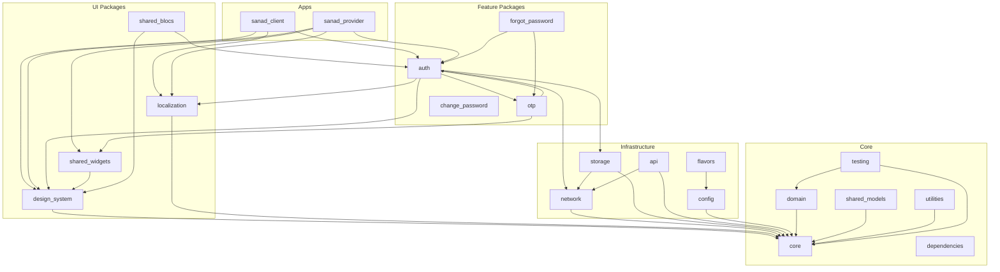

# Dependency Graph

## Overview



## Dependency Direction Rules

```
apps → feature packages → UI/infra packages → core
```

Allowed:
- `sanad_provider` → `auth` → `network` → `core`
- `auth` → `design_system` → `core`

Forbidden:
- `core` → `auth` (reverse)
- `auth` → `sanad_provider` (package importing app)
- `domain` → `data` (layer violation)

## Layer Dependencies (Feature Packages)

```
presentation/ → domain/, design_system/, localization/
data/ → domain/, network/, storage/
domain/ → core/ only
di/ → all layers
routes/ → (path constants only)
```

## Known Issues

- `settings` package exists on disk but is not in workspace — do not depend on it
- `api`, `analytics`, `notifications`, `change_password` are stubs with minimal implementation
